## 🏆 LeagueMaster

<p align="center">
  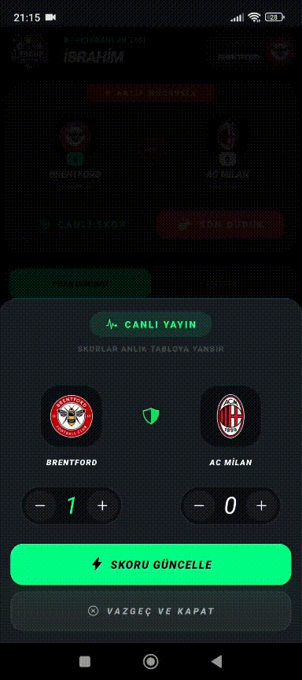
</p>

>LeagueMaster, arkadaş grupları ve turnuva düzenleyen gruplar için geliştirilmiş; yüksek performanslı, gerçek zamanlı (real-time) senkronizasyon yeteneklerine sahip bir lig yönetim ekosistemidir.


### 🚀 Öne Çıkan Özellikler

- **Real-time Lobby:** Kullanıcılar liglere davet koduyla katılırken, lobiye giren her oyuncu anlık olarak tüm katılımcılar tarafından görülür.
- **Dinamik Fikstür Motoru (PL/pgSQL):** Lig başlatıldığı anda Round Robin algoritması ile tek veya çift devreli fikstürleri PostgreSQL seviyesinde (RPC) milisaniyeler içinde oluşturur.
- **Live Score & Canlı Puan Durumu:** Maçlar oynanırken (live statüsünde) girilen skorlar, puan durumuna anlık yansır. Gelişmiş SQL fonksiyonları ile anlık tablo hesaplamaları yapılır.
- **API-Football Entegrasyonu:** Gerçek dünya takımları, kadroları ve logoları, harici futbol API'ları üzerinden otomatik olarak senkronize edilir.
- **Kariyer Yönetimi & İstatistikler:** Tüm tamamlanmış liglerdeki performans verileri (Gol, Asist, MOTM/MVP, Galibiyet Oranı) kullanıcı profilinde kümülatif ve kalıcı olarak saklanır.
- **Akıllı İstatistik Tetikleyicileri:** Veri tutarlılığını koruyan, skor güncellendiğinde tüm tabloları senkronize eden veritabanı trigger'ları.
- **Modern Arayüz:** Tailwind CSS/NativeWind ile optimize edilmiş UX tasarımı.


### 📱 App Screenshots

> Ekran görüntüleri üzerine tıklayarak tam boy görüntüleyebilirsiniz.

<p align="center">
  <a href="https://raw.githubusercontent.com/kirisibrahim/LeagueMaster/main/screenshots/foto1.jpeg">
    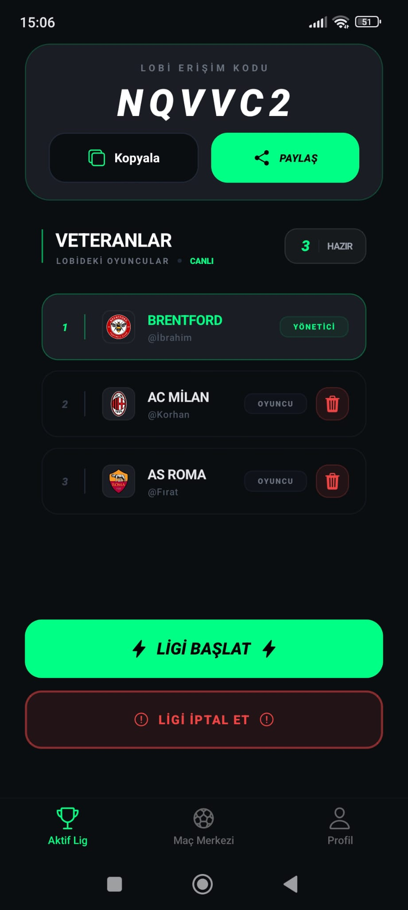
  </a>
  <a href="https://raw.githubusercontent.com/kirisibrahim/LeagueMaster/main/screenshots/foto2.jpeg">
    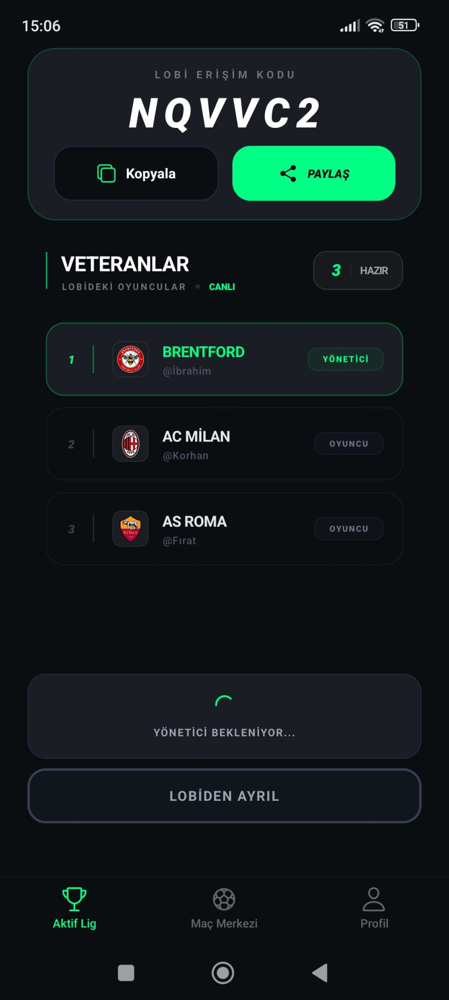
  </a>
  <a href="https://raw.githubusercontent.com/kirisibrahim/LeagueMaster/main/screenshots/foto3.jpeg">
    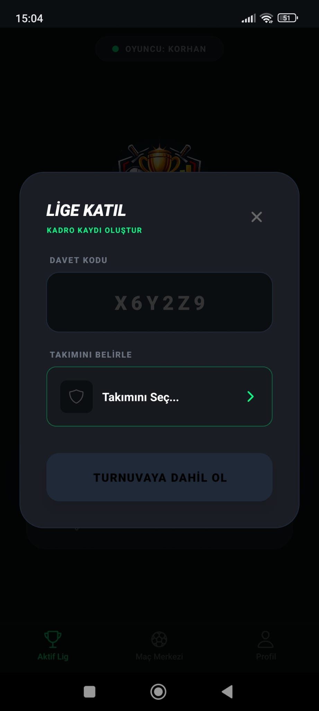
  </a>
  <a href="https://raw.githubusercontent.com/kirisibrahim/LeagueMaster/main/screenshots/foto4.jpeg">
    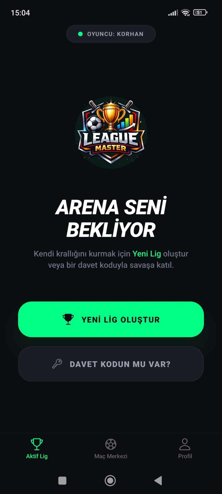
  </a>
</p>

<p align="center">
  <a href="https://raw.githubusercontent.com/kirisibrahim/LeagueMaster/main/screenshots/foto5.jpeg">
    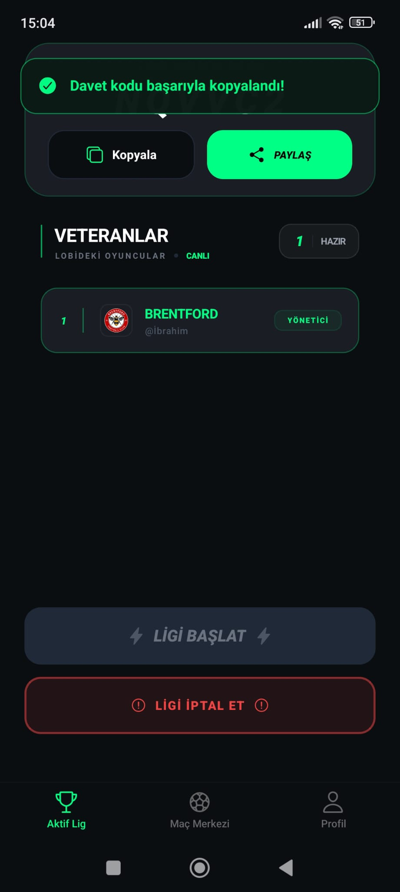
  </a>
  <a href="https://raw.githubusercontent.com/kirisibrahim/LeagueMaster/main/screenshots/foto6.jpeg">
    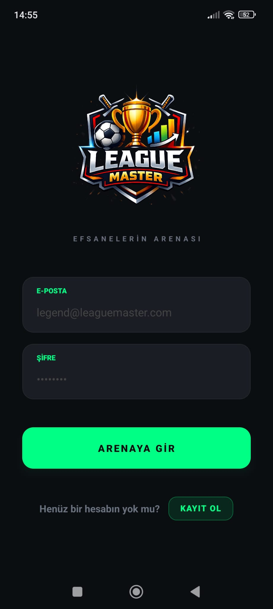
  </a>
  <a href="https://raw.githubusercontent.com/kirisibrahim/LeagueMaster/main/screenshots/foto7.jpeg">
    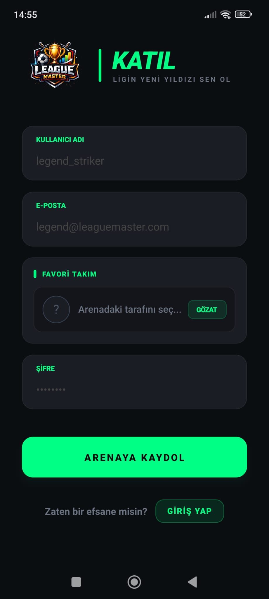
  </a>
  <a href="https://raw.githubusercontent.com/kirisibrahim/LeagueMaster/main/screenshots/foto8.jpeg">
    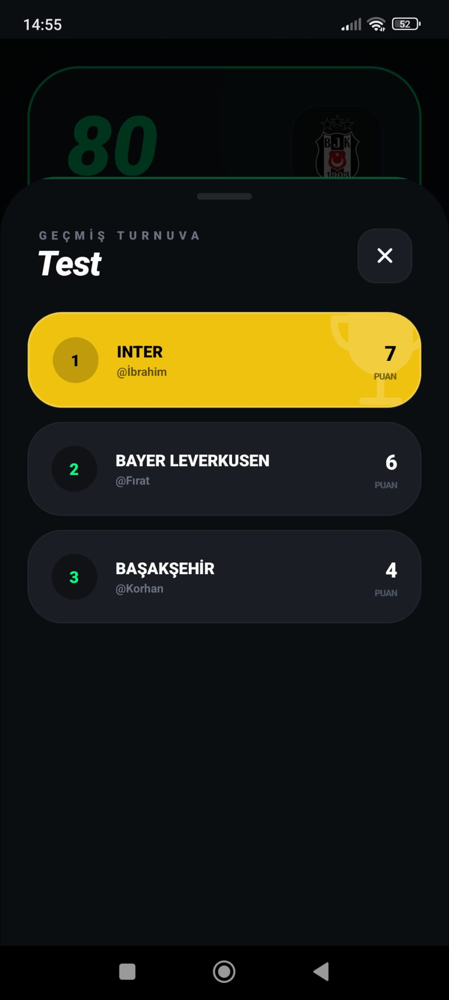
  </a>
</p>

<p align="center">
  <a href="https://raw.githubusercontent.com/kirisibrahim/LeagueMaster/main/screenshots/foto9.jpeg">
    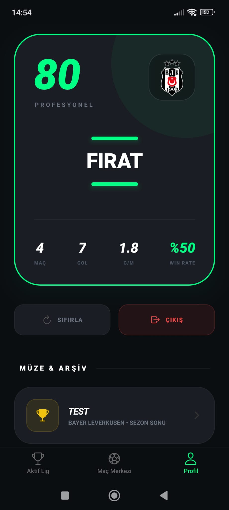
  </a>
  <a href="https://raw.githubusercontent.com/kirisibrahim/LeagueMaster/main/screenshots/foto10.jpeg">
    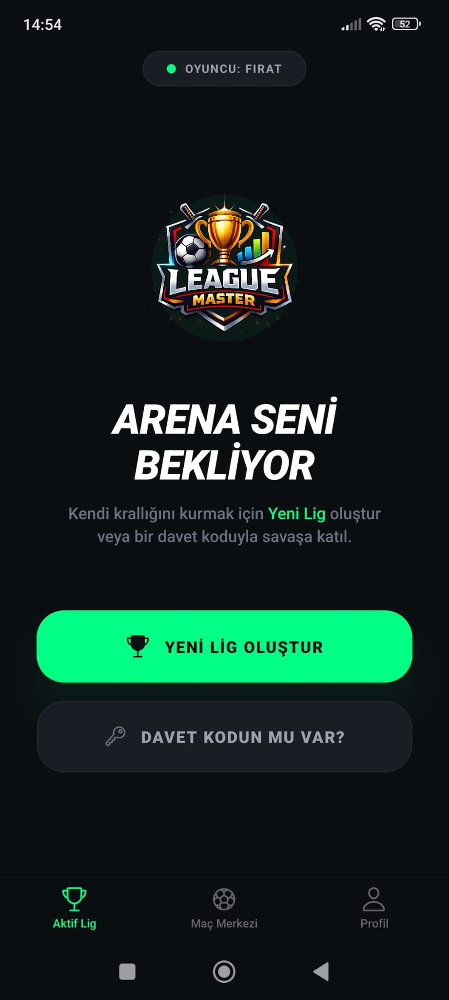
  </a>
  <a href="https://raw.githubusercontent.com/kirisibrahim/LeagueMaster/main/screenshots/foto11.jpeg">
    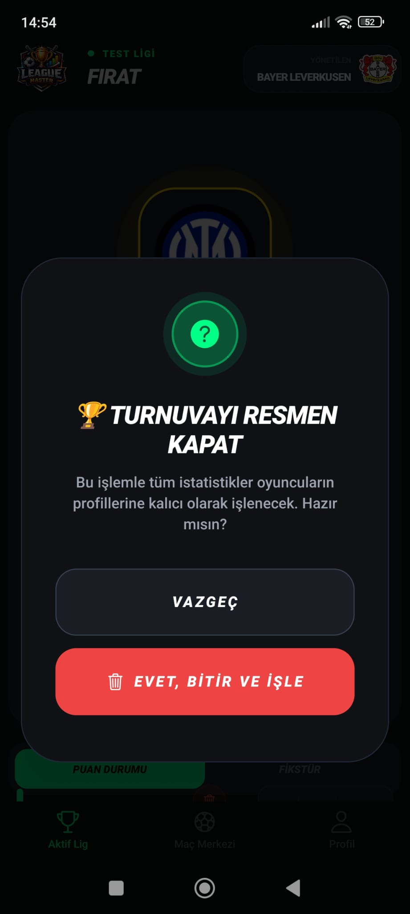
  </a>
  <a href="https://raw.githubusercontent.com/kirisibrahim/LeagueMaster/main/screenshots/foto12.jpeg">
    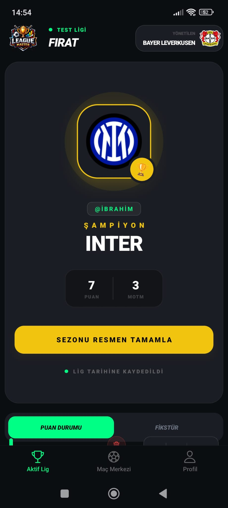
  </a>
</p>

<p align="center">
  <a href="https://raw.githubusercontent.com/kirisibrahim/LeagueMaster/main/screenshots/foto13.jpeg">
    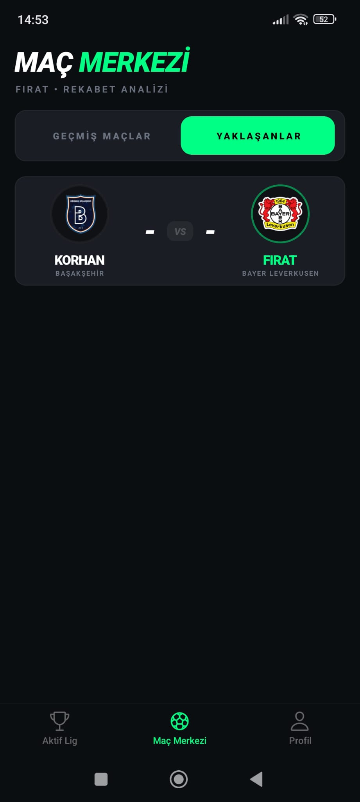
  </a>
  <a href="https://raw.githubusercontent.com/kirisibrahim/LeagueMaster/main/screenshots/foto14.jpeg">
    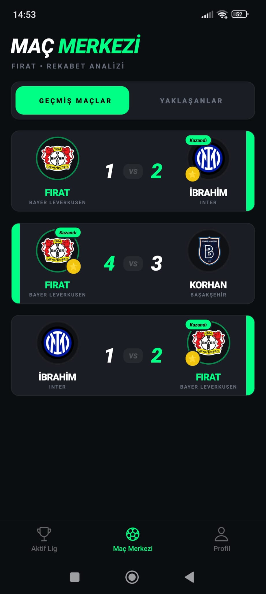
  </a>
  <a href="https://raw.githubusercontent.com/kirisibrahim/LeagueMaster/main/screenshots/foto15.jpeg">
    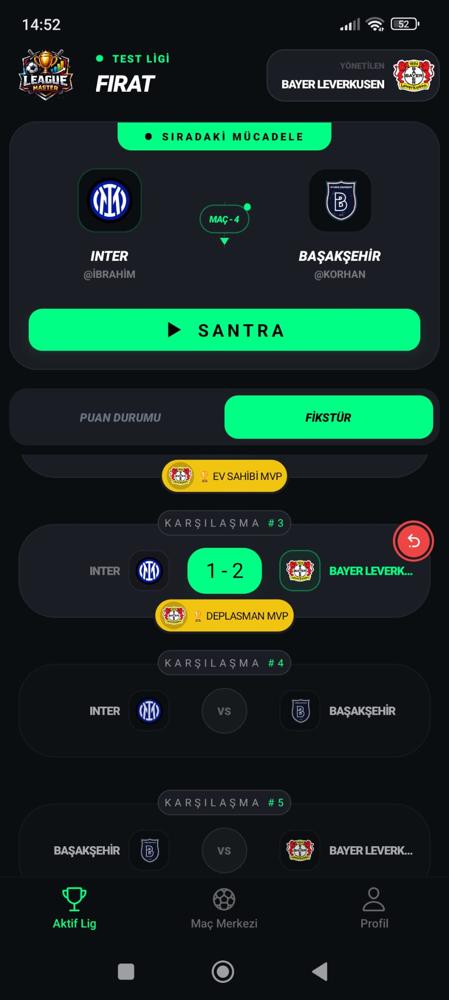
  </a>
  <a href="https://raw.githubusercontent.com/kirisibrahim/LeagueMaster/main/screenshots/foto16.jpeg">
    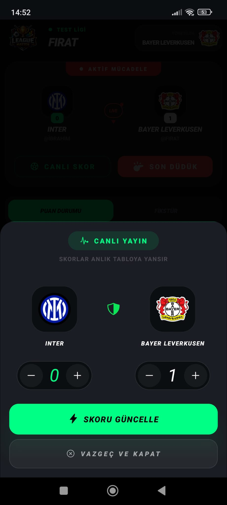
  </a>
</p>

<p align="center">
  <a href="https://raw.githubusercontent.com/kirisibrahim/LeagueMaster/main/screenshots/foto17.jpeg">
    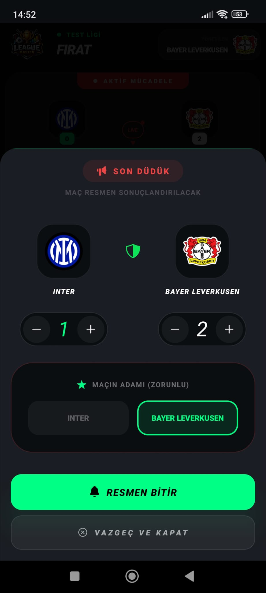
  </a>
  <a href="https://raw.githubusercontent.com/kirisibrahim/LeagueMaster/main/screenshots/foto18.jpeg">
    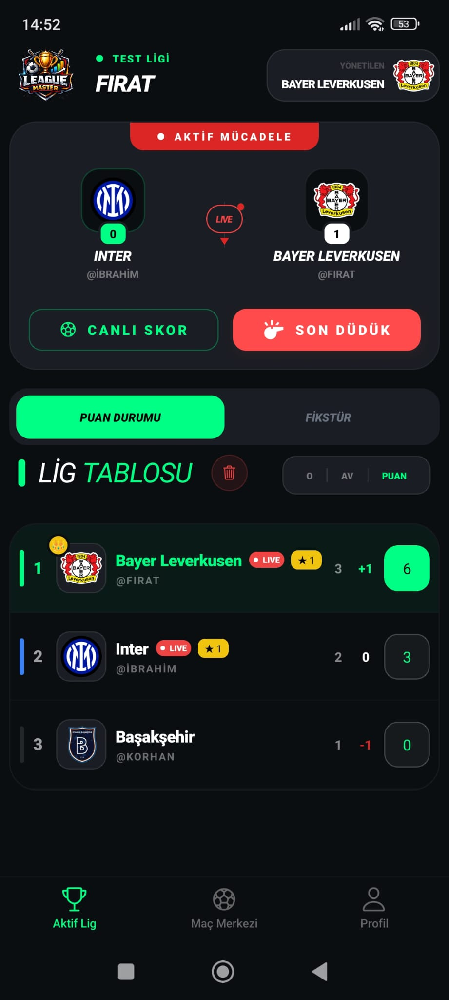
  </a>
</p>

### 📱 APK İndir
En son alığım android buildini bu linkden indirebilirsiniz : 
[LeagueMaster APK İndir](https://expo.dev/artifacts/eas/nfX3ynyv3v59josieEWk7N.apk)


### 🏗 Teknik Mimari ve Katmanlar

> Uygulama, "Separation of Concerns" (Sorumlulukların Ayrılması) prensibine sadık kalarak inşa edilmiştir. İş mantığının (Business Logic) büyük bir kısmı maksimum hız ve veri güvenliği için veritabanı seviyesinde çözülmüştür.

#### Frontend Teknolojileri

- **Framework:** React Native (Expo SDK) / React 18 & TypeScript.
- **Styling:** NativeWind (Tailwind CSS for Mobile).
- **State Management:** Zustand (Centralized UI Store) & TanStack Query v5 (Server State & Optimistic Updates).
- **Animations & Navigation:** Moti (Reanimated 3 wrapper) & Expo Router (File-based routing).

#### 🛡 Backend & Veritabanı (PostgreSQL & Supabase)

- **Auth:** Supabase Auth (OTP & Metadata Support).
- **Real-time:** Supabase Realtime (Postgres Changes - Websocket tabanlı).
- **Security:** Row Level Security (RLS) ile kullanıcı bazlı veri izolasyonu.
- **Mimari Katmanlar:**
    - **Hooks Layer (/hooks):** İş mantığı ve Supabase etkileşimleri (örn: useLeagueActions, useLobby).
    - **Store Layer (/store):** Global UI state yönetimi.
    - **Service Layer (/services):** Dış dünya API entegrasyonları (örn: TeamSyncService).
    - **Types Layer (/types):** %100 TypeScript tip güvenliği.

### 💾 Veri Modeli ve Veritabanı Katmanı

> Veritabanı mimarisi, ilişkisel bütünlüğü (Referential Integrity) koruyacak şekilde atomik ve normalize bir yapıdadır:

#### ⚙️ Kritik İş Mantığı (Server-Side Logic)
> Sistem, iş yükünü istemciden (client) alıp veritabanı katmanına (PostgreSQL) kaydırarak veri güvenliğini ve hızını maksimize eder:

- **trigger_update_standings:** Maç skorları güncellendiği anda tetiklenir; league_participants tablosundaki istatistikleri (G, B, M, Averaj) anlık olarak yeniden hesaplar.

- **on_auth_user_created_stats:** Yeni bir kullanıcı kayıt olduğu anda otomatik olarak profiles ve user_career_stats satırlarını oluşturarak kullanıcıyı sisteme hazırlar.

- **league_standings:** Karmaşık join operasyonlarını minimize eden, league_participants verilerini anlık puan tablosuna dönüştüren yüksek performanslı katman.

#### 📊 Detaylı Tablo Yapısı

| Tablo Adı | Sorumluluk | Öne Çıkan Kolonlar |
| :--- | :--- | :--- |
| **profiles** | Kullanıcı kimlik ve profil yönetimi. | `username`, `avatar_url`, `favorite_team_id` |
| **leagues** | Lig kuralları, dinamik puanlama ve erişim yönetimi. | `name`, `win_points`, `loss_points`, `invite_code`, `status` |
| **matches** | Fikstür akışı, canlı skorlar ve MOTM verileri. | `home_score`, `away_score`, `is_completed`, `motm_user_id`, `round_number` |
| **league_participants** | Oyuncuların lig özelindeki detaylı performans verileri. | `team_name`, `points`, `played`, `won`, `lost`, `drawn`, `goals_for/against` |
| **league_standings** | Anlık hesaplanan (aggregate) canlı puan tablosu katmanı. | `points`, `won`, `lost`, `drawn`, `goals_for/against` |
| **user_career_stats** | Oyuncunun tüm liglerdeki kümülatif kariyer özeti. | `total_matches`, `total_wins`, `total_mvp`, `goals_for` |
| **official_leagues** | Senkronize edilmiş gerçek dünya ligleri kütüphanesi. | `name`, `country`, `api_id`, `logo_url` |
| **official_teams** | Profesyonel takımlar, logolar ve kurumsal renkler. | `name`, `colors (jsonb)`, `api_id`, `league_id` |

### Sistem Mimari Şeması

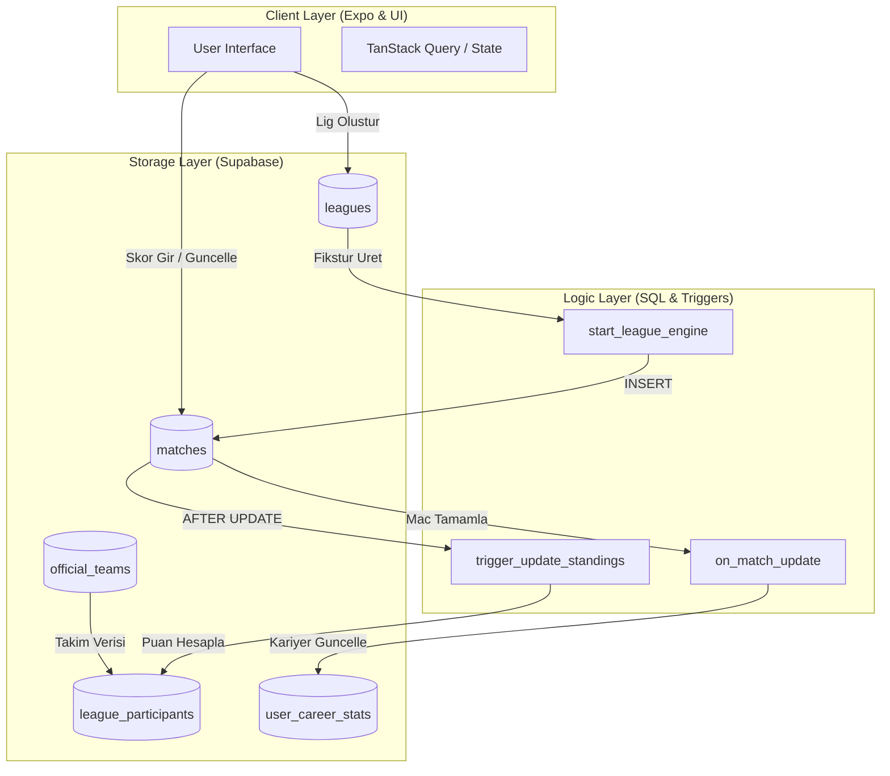

#### Şemanın Teknik Özeti

- **Decoupled Architecture:** Lig istatistikleri (LP) ile genel kariyer verileri (UCS) birbirinden ayrılarak veri yoğunluğu optimize edilmiştir.

- **Trigger-Based Accuracy:** Puan durumu hesaplamaları uygulama tarafında değil, veritabanı seviyesinde trigger_update_standings ile yapılarak veri tutarlılığı (Data Integrity) garanti altına alınmıştır.

- **Event-Driven Stats:** Maçlar tamamlandığında (on_match_update), global istatistikler asenkron bir tetikleyici ile güncellenir.

## ⚙️ Kurulum ve Başlatma

1. Depoyu Klonlayın:

```bash
git clone https://github.com/kullaniciadi/LeagueMaster.git
cd LeagueMaster
```

2. Bağımlılıkları Yükleyin:

```bash
npm install
```

3. Çevresel Değişkenleri Ayarlayın(.env):

```
EXPO_PUBLIC_SUPABASE_URL=your_supabase_url
EXPO_PUBLIC_SUPABASE_ANON_KEY=your_anon_key
EXPO_PUBLIC_FOOTBALL_API_KEY=your_api_sports_key
EXPO_PUBLIC_FOOTBALL_API_URL=https://v3.football.api-sports.io
```

4. Veritabanı Kurulumu:

> supabase/migrations klasöründeki SQL dosyalarını Supabase Dashboard veya CLI üzerinden çalıştırarak PL/pgSQL fonksiyonlarını ve tetikleyicileri tanımlayın.

5. Uygulamayı Çalıştırın:

```bash
npx expo start
```

## 📈 Gelecek Yol Haritası (Roadmap)

- **[ ] Push Notifications:** Maç başlangıçları ve kritik skorlar için Expo Notifications.

- **[ ] Eleme Usulü (Knockout) Desteği:** Şampiyonlar Ligi tarzı turnuva formatı.

- **[ ] Detaylı Analitikler:** Victory Native ile maç bazlı oyuncu rating ve performans grafikleri.

- **[ ] Lig İçi Chat:** Takımlar için real-time mesajlaşma modülü.

## 🤝 Katkıda Bulunma

> Katkıda bulunmak için önce bir "Issue" açabilir veya "Pull Request" gönderebilirsiniz.

## 📄 License

Bu proje MIT Lisansı ile lisanslanmıştır.
